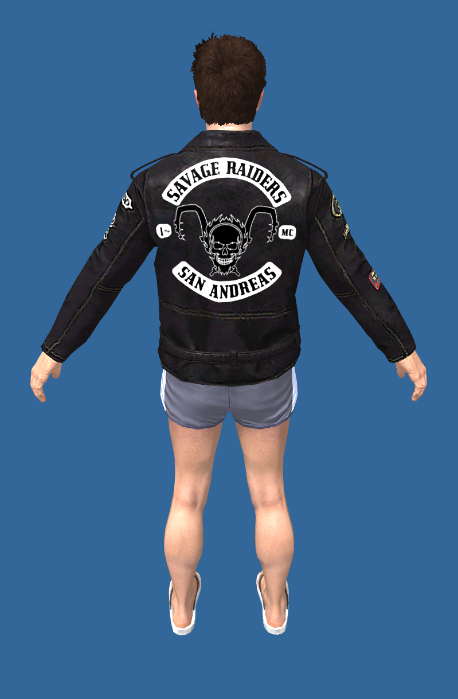
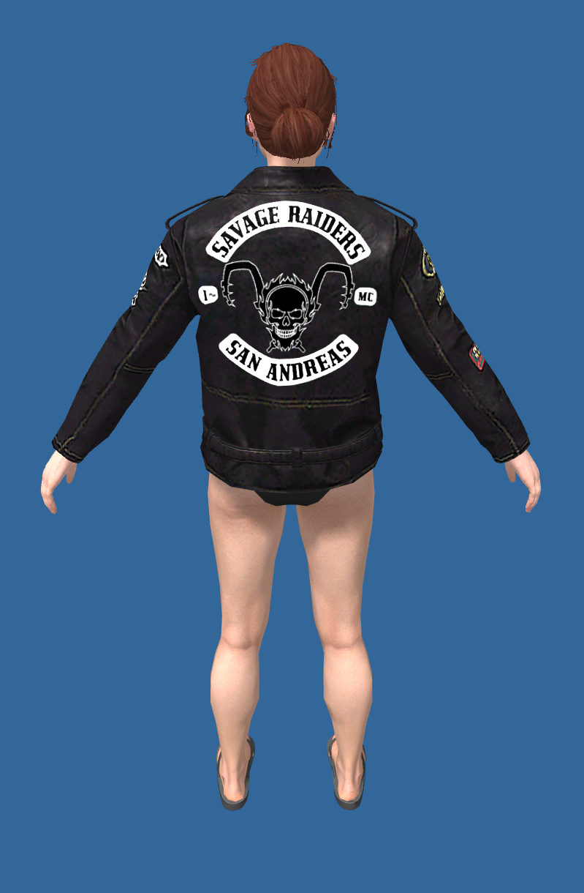
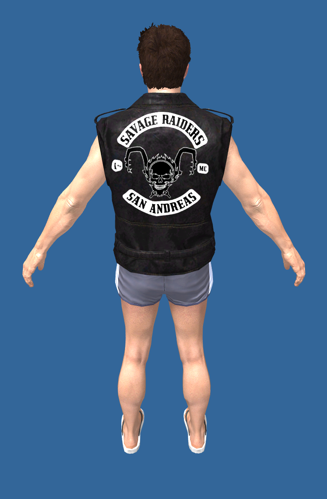
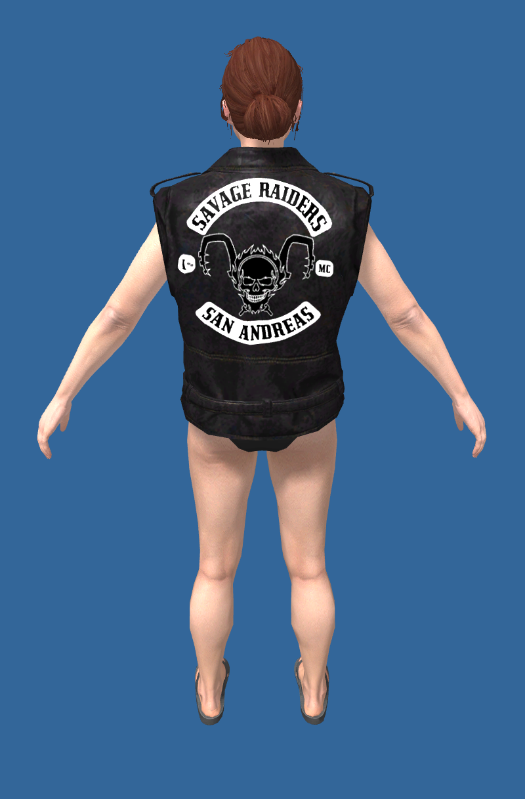

# Savage Raiders Clothing

Pack de vetements pour les Savage Raiders version Homme & Femme.

## Installation

1. Copiez le dossier `maz-sr` dans le dossier `resources` de votre serveur FiveM.
2. Ajoutez cette ligne a votre `server.cfg` :

```cfg
ensure maz-sr
```

3. Redemarrez la ressource ou le serveur.

Le fichier `fxmanifest.lua` declare automatiquement les metadonnees necessaires. Ne supprimez pas le dossier `stream` ni les sous-dossiers `[male]` et `[female]`.

## Utilisation

Le pack ajoute des variations de vetements sur le composant `jbib` des ped models freemode homme et femme. Selectionnez les variations depuis votre script de vetements ou votre menu de personnalisation.

## Gallery

<p align="center">
  
  
</p>

<p align="center">
  
  
</p>

## Compatibilite

- GTA V / FiveM
- `mp_m_freemode_01`
- `mp_f_freemode_01`

## Credits

- Auteur : @Mazzeh_
